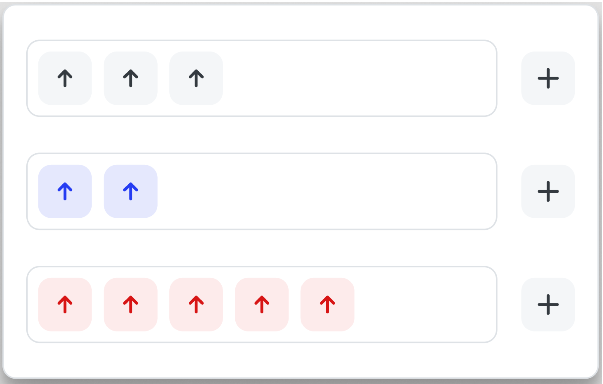

# UpVote-Project

## Project Description

### A Vue fronend project using vue/cli and Vuex for state management. A simple project in which when user clicks the "+" sign an upvote gets added to the group. Upvote upon click toggles between selected/unselected which changes the color and background color of the upvote.

## Project setup

```
npm install
```

### Compiles and hot-reloads for development

```
npm run serve
```

### Wireframe



### Compiles and minifies for production

```
npm run build
```

### Lints and fixes files

```
npm run lint
```

### Customize configuration

See [Configuration Reference](https://cli.vuejs.org/config/).
